<picture>
  <source media="(prefers-color-scheme: dark)"  srcset="assets/hero-dark.svg">
  <source media="(prefers-color-scheme: light)" srcset="assets/hero-light.svg">
  
</picture>

  &nbsp;
  &nbsp;
  &nbsp;
  &nbsp;
  

 

Kurumsal iş yazılımı geliştiriyorum. Odağım demo veya prototip değil, **üretimde çalışan, bakımı yapılan ve gerçek kullanıcısı olan** sistemler.

Yazdığım ERP bir mühendislik firmasında yaklaşık on istemciyle her gün kullanılıyor. Uygulamanın yanı sıra merkez sunucu kurulumunu, ağ yapılandırmasını, yedekleme stratejisini ve saha dağıtımını da ben yürüttüm — yazılımın yalnızca *kodlanan* değil **işletilen** bir şey olduğunu orada öğrendim. Konum tabanlı keşif platformum Civari ise tasarımından sunucu yönetimine kadar tek başıma geliştirilip yayına alındı ve şu an canlıda.

 

## Öne çıkan sistemler

<table>
<tr>
<td width="50%" valign="top">

### ERP Suite
**`.NET 10`** · Clean Architecture · PostgreSQL · JWT

Şantiye yönetimi için uçtan uca kurumsal sistem. **Tek API üç istemciyi besler:** REST servis, WinForms masaüstü ve kurulabilir PWA.

Puantaj ve hakediş, malzeme talep onay akışı, ~3.000 kalemlik fiyat listesi, depo, rol bazlı yetkilendirme, anlık mesajlaşma.

`20 entity` `20 controller` `24 masaüstü ekranı`

**[→ Depoyu incele](https://github.com/canogluy06-byte/dotnet-erp-clean-architecture)**

</td>
<td width="50%" valign="top">

### Civari &nbsp;🟢 canlı
**`PHP 8`** · MySQL · Leaflet · Capacitor

Ankara merkezli mekân keşif platformu. Harita, mekânları görünen alana göre yükler; veri **OpenStreetMap/Overpass**'tan otomatik çekilip yerel şemaya eşlenir.

Check-in, değerlendirme, favori, liderlik tablosu, işletme sahibi paneli ve moderasyon.

`PWA` `service worker` `OSM ingest`

**[→ Depoyu incele](https://github.com/canogluy06-byte/civari)** · **[civari.com.tr](https://civari.com.tr)**

</td>
</tr>
<tr>
<td width="50%" valign="top">

### Finans Takip
**`.NET 8`** · WinForms · SQLite

Çek/senet vade takvimi. Takvim hücreleri ve bildirim bileşenleri hazır kontrol değil — kendi `OnPaint` uygulamalarıyla çizildi, böylece DPI değişiminde tutarlı kalır.

Arşiv, vade bildirimleri, zamanlanmış otomatik yedekleme.

**[→ Depoyu incele](https://github.com/canogluy06-byte/winforms-finance-tracker)**

</td>
<td width="50%" valign="top">

### Idle Music Game
**`Unity`** · C#

Idle oyun prototipi. Arayüzün tamamı Inspector'da sürüklenerek değil, **çalışma zamanında C# ile** kuruluyor — layout diff'te okunabilir ve kaynaktan birebir yeniden üretilebilir kalıyor.

**[→ Depoyu incele](https://github.com/canogluy06-byte/unity-idle-music-game)**

</td>
</tr>
</table>

  &nbsp;
  &nbsp;
  &nbsp;
  

 

## Yetkinlik × Sistem

Yetkinlik listesi yerine **kanıt tablosu**: her satırın hangi sistemde fiilen uygulandığı.

<picture>
  <source media="(prefers-color-scheme: dark)"  srcset="assets/matrix-dark.svg">
  <source media="(prefers-color-scheme: light)" srcset="assets/matrix-light.svg">
  
</picture>

 

## Mimari

<picture>
  <source media="(prefers-color-scheme: dark)"  srcset="assets/systems-dark.svg">
  <source media="(prefers-color-scheme: light)" srcset="assets/systems-light.svg">
  
</picture>

Bağımlılıklar içeri doğru akar: `Domain` veritabanını, web çatısını veya arayüzü tanımaz. Pratik kazancı şu — puantaj hesabı değiştiğinde masaüstü, mobil ve tarayıcı **aynı anda** doğru davranır; üç ayrı yerde düzeltme yapılmaz.

 

## Mühendislik prensipleri

| | |
|:--|:--|
| **Gizli bilgi koda girmez** | Kimlik bilgileri ortam değişkenlerinden okunur; depolarda yalnızca `.env.example` bulunur. Bu profildeki dokuz deponun hiçbirinde parola, anahtar veya müşteri verisi yoktur. |
| **Tek kaynak, çok istemci** | İş kuralı bir kez yazılır; masaüstü, mobil ve web aynı sözleşmeyi tüketir. Kural değişirse üç yerde değil, bir yerde değişir. |
| **Veri kaybı varsayılan değildir** | Finansal ve operasyonel kayıtlarda yedekleme bir menü öğesi değil, zamanlanmış bir servistir. |
| **Bağımlılık bilinçli seçilir** | Sekiz yazılık bir blog için veritabanı sunucusu gerekmez; on istemcili bir ERP için tam katmanlı mimari gerekir. Aynı cevabı her soruya vermiyorum. |
| **Görsel de koddur** | Bu sayfadaki üç grafik dış servisten gelmiyor — depoda duran, elle yazılmış, tema duyarlı SVG'ler. Üçüncü parti bir servis düştüğünde profil bozulmaz. |

 

## İletişim

  
  
  

  Müşteri işlerinin depoları <b>portfolyo sürümüdür</b>: kimlik bilgileri, personel kayıtları, tedarikçi ve fiyat bilgileri ile marka varlıkları kaldırılmış, yerlerine jenerik demo değerleri konmuştur. Mimari, kod ve arayüz değişmemiştir. Civari kendi ürünüm olduğu için kendi kimliğiyle yayındadır.

