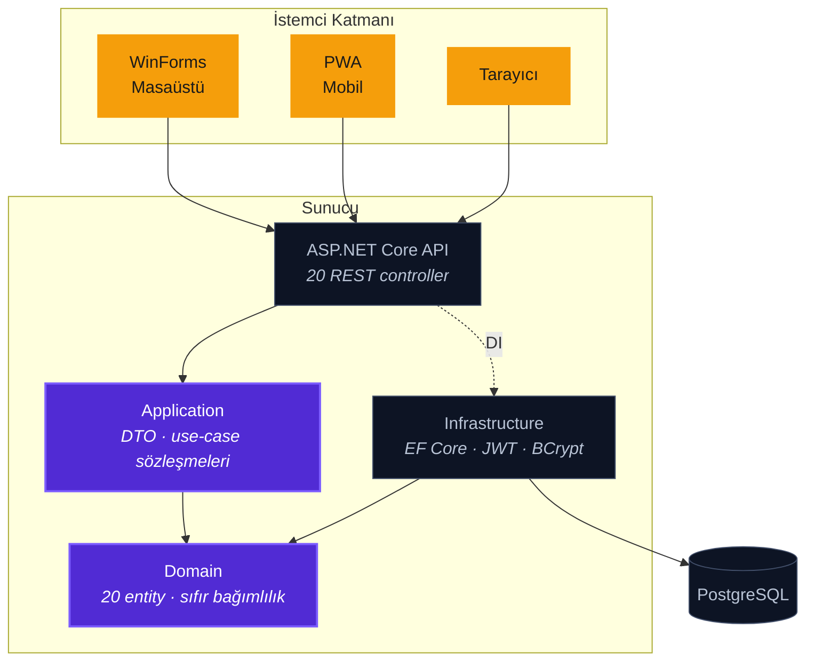

  

  
  
  
  

---

## Profil

Kurumsal iş yazılımı geliştiriyorum. Odağım demo veya prototip değil, **üretimde çalışan, bakımı yapılan ve gerçek kullanıcısı olan** sistemler.

Geliştirdiğim ERP bir mühendislik firmasında yaklaşık **10 istemciyle her gün** kullanılıyor; uygulamanın yanı sıra merkez sunucu kurulumunu, ağ yapılandırmasını, yedekleme stratejisini ve saha dağıtımını da ben yürüttüm. Yazılımın yalnızca kodlanan değil, **işletilen** bir şey olduğunu bu süreçte öğrendim.

<table>
<tr>
<td align="center" width="25%"><b>8</b> yayınlanan sistem</td>
<td align="center" width="25%"><b>~10</b> günlük aktif istemci</td>
<td align="center" width="25%"><b>3</b> istemci tipi, tek API</td>
<td align="center" width="25%"><b>30</b> iş günü kurumsal staj</td>
</tr>
</table>

---

## Mimari yaklaşım

Bağımlılıklar içeri doğru akar. İş kuralları veritabanını, web çatısını veya arayüzü tanımaz; bu sayede aynı domain üç farklı istemciyi besleyebiliyor.

**Bu yapının pratik kazancı:** iş kuralı tek yerde durur. Puantaj hesabı değiştiğinde masaüstü, mobil ve tarayıcı aynı anda doğru davranır — üç ayrı yerde düzeltme yapılmaz.

---

## Öne çıkan sistemler

<table>
<tr>
<td width="50%" valign="top">

### [ERP Suite](https://github.com/canogluy06-byte/dotnet-erp-clean-architecture)
`.NET 10` `Clean Architecture` `PostgreSQL` `JWT`

Şantiye yönetimi için uçtan uca kurumsal sistem. Tek API üç istemciyi besler: REST servis, WinForms masaüstü ve kurulabilir PWA.

**20** entity · **20** controller · **24** masaüstü ekranı

Puantaj ve hakediş, malzeme talep onay akışı, fiyat listesi, depo, rol bazlı yetkilendirme, anlık mesajlaşma.

</td>
<td width="50%" valign="top">

### [Nearby — Venue Discovery](https://github.com/canogluy06-byte/php-venue-discovery-pwa)
`PHP 8` `MySQL` `Leaflet` `Capacitor`

Konum tabanlı mekân keşif platformu. Viewport bazlı yükleme yapan harita; veri OpenStreetMap/Overpass'tan otomatik besleniyor.

Check-in, değerlendirme, favori, liderlik tablosu, işletme sahibi paneli ve moderasyon.

</td>
</tr>
<tr>
<td width="50%" valign="top">

### [Finans Takip](https://github.com/canogluy06-byte/winforms-finance-tracker)
`.NET 8` `WinForms` `SQLite`

Çek/senet vade takvimi. Takvim hücreleri ve bildirim bileşenleri hazır kontrol değil, kendi `OnPaint` uygulamalarıyla çizildi — DPI değişiminde tutarlı kalır.

Arşiv, vade bildirimleri, zamanlanmış otomatik yedekleme.

</td>
<td width="50%" valign="top">

### [Idle Music Game](https://github.com/canogluy06-byte/unity-idle-music-game)
`Unity` `C#`

Idle oyun prototipi. Arayüzün tamamı Inspector'da sürüklenerek değil, **çalışma zamanında C# ile** kuruluyor; böylece layout diff'te okunabilir ve kaynaktan birebir yeniden üretilebilir kalıyor.

</td>
</tr>
</table>

  
  
  
  

---

## Teknoloji yetkinliği

  

| Alan | Teknolojiler | Uygulandığı sistem |
|---|---|---|
| **Backend** | ASP.NET Core · EF Core · REST · OpenAPI | ERP Suite |
| **Mimari** | Clean Architecture · DI · katmanlı tasarım | ERP Suite |
| **Güvenlik** | JWT Bearer · BCrypt · rol bazlı yetkilendirme | ERP Suite |
| **Veritabanı** | PostgreSQL · MySQL · SQLite · şema migrasyonu | Tümü |
| **Masaüstü** | WinForms · custom `OnPaint` kontrolleri · tema katmanı | Finans Takip · ERP istemcisi |
| **Web** | PHP 8 · PDO · vanilla JS · Leaflet | Nearby · Kurumsal site · Blog |
| **Mobil** | PWA · service worker · Capacitor | Nearby |
| **Oyun** | Unity · runtime UI üretimi | Idle Music Game |
| **Operasyon** | Sunucu kurulumu · ağ yapılandırması · yedekleme · dağıtım | ERP Suite |

---

## Çalışma prensipleri

| | |
|---|---|
| **Gizli bilgi koda girmez** | Kimlik bilgileri ortam değişkenlerinden okunur; depolarda yalnızca `.env.example` bulunur. |
| **Tek kaynak, çok istemci** | İş kuralı bir kez yazılır; masaüstü, mobil ve web aynı sözleşmeyi tüketir. |
| **Veri kaybı varsayılan değildir** | Finansal ve operasyonel kayıtlarda yedekleme bir menü öğesi değil, zamanlanmış bir servistir. |
| **Bağımlılık bilinçli seçilir** | Küçük bir blog için veritabanı sunucusu, kurumsal ERP için ise tam katmanlı mimari. |

---

## İletişim

  
  
  
  

  <i>Depoların çoğu <b>portfolyo sürümüdür</b>. Gerçek müşteri verisi, kimlik bilgileri, personel kayıtları, tedarikçi ve fiyat bilgileri ile marka varlıkları kaldırılmış; yerlerine jenerik demo değerleri konmuştur. Mimari, kod ve arayüz değişmemiştir.</i>

